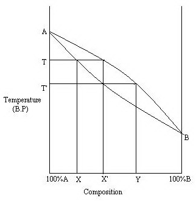
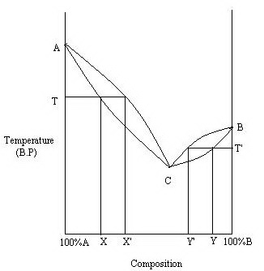

## Theory 

### Fractional Distillation:
 

Fractional distillation is employed to separate two or more liquids that are miscible. It is a special type of distillation designed to separate a mixture of two or more liquids that have different boiling points. The process involves heating the mixture and partial condensation of the vapours along a fractionating column, which is set up such that components with lower boiling points pass through the column and are collected earlier than components with higher boiling points. Repeated vaporization and condensation results in the separation of the components of the mixture. The efficiency of fractional distillation depends on the use of the fractionating column. The fractionating column is packed with glass beads. It provides a large surface area for vaporization and condensation of the liquid mixture.

 

### Fractional Distillation of Ideal Solutions

Fractional Distillation of Ideal Solutions can be explained using Boiling point-Composition graph.

<h2>Fractional Distillation</h2>

  Consider a composition <strong>X</strong>. On heating it boils at <strong>T</strong>. At this temperature, the vapour phase has composition <strong>X'</strong>. It is richer in B. So the residual liquid will be richer in A. Hence, by repeating the process, pure A can be obtained as the residual liquid.

  Consider vapours of composition <strong>X'</strong>. On cooling, a liquid of the same composition is obtained. On heating, it will boil at <strong>T'</strong>. At this temperature, the vapour has composition <strong>Y</strong>. It is again richer in B. So, by repeating the process, pure B can be obtained as the vapour. Thus, both the pure components can be obtained by fractional distillation of ideal solutions.

<h3>Ethanol-Water:</h3>

  Ethanol is more volatile than water, since it has a lower boiling point (78°C). The vapour rises through the fractionating column when the mixture is heated. Because ethanol is more volatile, the vapour contains more ethanol. The hot vapour condenses upon touching the cold glass beads. At the same time, there is continuous rise of hot vapour up the fractionating column. Hot vapour will make the condensed vapour boil again. Thus, it contains more and more ethanol as the vapour rises up the fractionating column.

  The above process is to be repeated until the vapour consists of only pure ethanol. During the process, the vapour escaping is measured by a thermometer at the fractionating column. The temperature will remain steady for some time and will then rise quickly to become pure ethanol.

<h3>Cyclohexane &amp; Toluene:</h3>

  Cyclohexane and toluene are miscible. To separate these two non-polar liquids, distillation is practical, fast, and effective. Cyclohexane has the lower boiling point (80.74°C) and is more volatile. The boiling point of toluene is 110.6°C. Toluene does not boil at the same temperature as cyclohexane, so cyclohexane will boil out of the mixture first.

<h3>Fractional Distillation of Real Solutions - Azeotropic Mixtures:</h3>

  Fractional distillation of real solutions can also be explained using a boiling point-composition graph.

  Consider a composition <strong>X</strong>. On heating, it boils at <strong>T</strong>. At this temperature, the vapour phase has composition <strong>X′</strong>. It is richer in <strong>C</strong>. So the residual liquid will be richer in <strong>A</strong>. Hence, by repeating the process, pure <strong>A</strong> can be obtained as the residual liquid. But pure <strong>B</strong> cannot be obtained.

  Now consider the composition <strong>Y</strong>. On heating, it will boil at <strong>T′</strong>. At this temperature, the vapour has composition <strong>Y′</strong>. It is again richer in <strong>C</strong>. So the residual liquid will be richer in <strong>B</strong>. Hence, by repeating the process, pure <strong>B</strong> can be obtained as the residual liquid. But pure <strong>A</strong> cannot be obtained.

  Thus, separation into both the pure components is <strong>not possible</strong> by fractional distillation of real solutions. We always obtain one pure liquid and an azeotropic mixture (e.g., rectified spirit).

